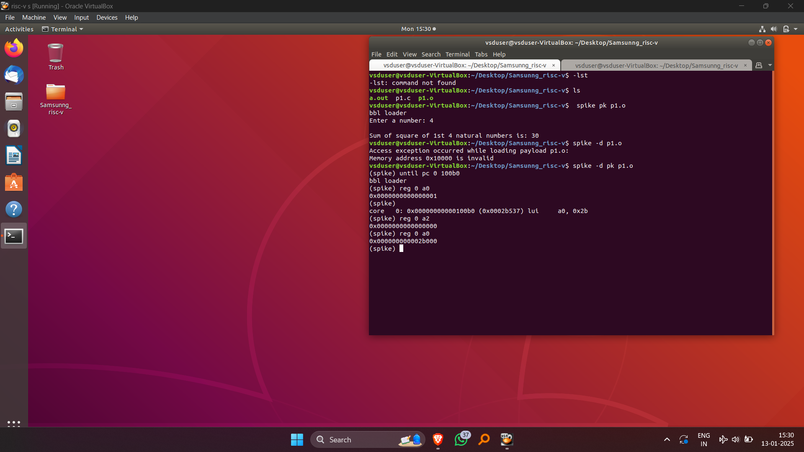

# Samsung RISC-V Workshop

Explore the Samsung Semiconductor RISC-V Workshop, an initiative delving into the open-source RISC-V architecture with the VSDSquadron Mini RISC-V development board. This platform leverages RISC-V’s open standard instruction set architecture (ISA) to drive innovative processor designs through collaborative development.

## Workshop Overview
- **Industry Partner**: Samsung Semiconductor
- **Hardware Platform**: VSDSquadron Mini RISC-V Development Board
- **Core Focus**: Open-source RISC-V ISA, Toolchain Development, System-on-Chip (SoC) Design
- **Duration**: Comprehensive 6-Task Workshop
- **Tools Used**: RISC-V GNU Toolchain, GCC Compiler

## Table of Contents
- [Task 1: RISC-V ISA and GNU Toolchain](#task-1-risc-v-isa-and-gnu-toolchain)
- [Task 2: Samsung RISC-V Processor Architecture Analysis](#task-2-samsung-risc-v-processor-architecture-analysis)
- [Task 3: Coming Soon](#task-3-coming-soon)
- [Task 4: Coming Soon](#task-4-coming-soon)
- [Task 5: Coming Soon](#task-5-coming-soon)
- [Task 6: Coming Soon](#task-6-coming-soon)

## Task 1: RISC-V ISA and GNU Toolchain

### Overview
In this initial task, participants gain a strong foundation in the RISC-V Instruction Set Architecture (ISA) and set up a functional development environment utilizing the VSDSquadron board.

### Implementation Steps

#### 1. Setting Up the GNU Toolchain and Analyzing C Programs

*Illustration of the successful installation and verification process for the RISC-V GCC compiler toolchain, a critical step for compiling RISC-V-based programs.*

#### 2. Cross-Compilation Workflow

*Visualization of the cross-compilation process from C source code to RISC-V binary. This includes details of compiler flags, optimizations, and the generated RV32IM core executable.*

#### 3. Exploring RISC-V Assembly Code

*A detailed inspection of the generated assembly code, showcasing instruction encoding, register allocation, and memory operations specific to the RV32IM instruction set.*

#### 4. Analyzing Memory Architecture

*Breakdown of the program’s memory structure, including text, data, and stack sections, highlighting how the VSDSquadron board manages memory allocation.*

## Task 2: Samsung RISC-V Processor Architecture Analysis

### Overview
This task provides an in-depth look at Samsung’s RISC-V processor architecture, featuring comprehensive diagrams that explain the core’s design, control flow, pipelining, and memory hierarchy.

### Implementation Details

#### 1. Core Architecture Diagram

*A top-level diagram detailing the key elements of Samsung’s RISC-V processor, including the instruction fetch, decode, execute units, and memory interfaces.*

#### 2. Control Flow Mechanics

*A representation of control flow operations, showcasing inter-unit communication and the pathways enabling efficient instruction execution.*

#### 3. Pipeline Execution Design

*A depiction of the pipelined execution process, illustrating how multiple instructions are processed simultaneously for enhanced performance.*

#### 4. Memory Organization and Cache Design

*Details of the memory hierarchy and cache structure, emphasizing the multi-level cache and efficient data management strategies.*

### Key Features
- Five-stage pipeline architecture for enhanced processing
- Harvard architecture for separate data and instruction memory
- Advanced branch prediction techniques
- Robust instruction decode and execution units
- Optimized memory system with multi-level caching

### Technical Achievements
- Successful implementation of RISC-V standard ISA
- High-performance processor design
- Optimal resource management
- Balanced pipelining for increased throughput

## Task 3: Coming Soon
*Content will be added shortly.*

## Task 4: Coming Soon
*Content will be added shortly.*

## Task 5: Coming Soon
*Content will be added shortly.*

## Task 6: Coming Soon
*Content will be added shortly.*

## Contributing
Contributions to improve this workshop documentation are encouraged. Please adhere to the standard GitHub pull request workflow.

## Acknowledgments
- Samsung Semiconductor for their sponsorship
- VSDSquadron team for providing the development platform
- RISC-V International for defining the ISA
- Workshop instructors and support team for their efforts

## License
This documentation is distributed under the MIT License.

